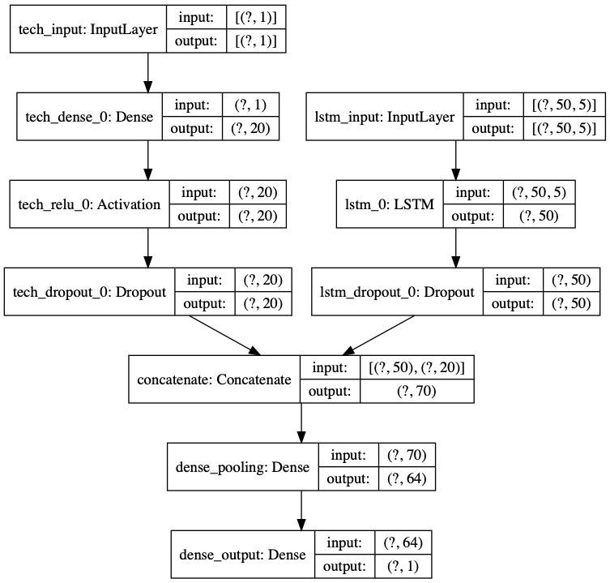
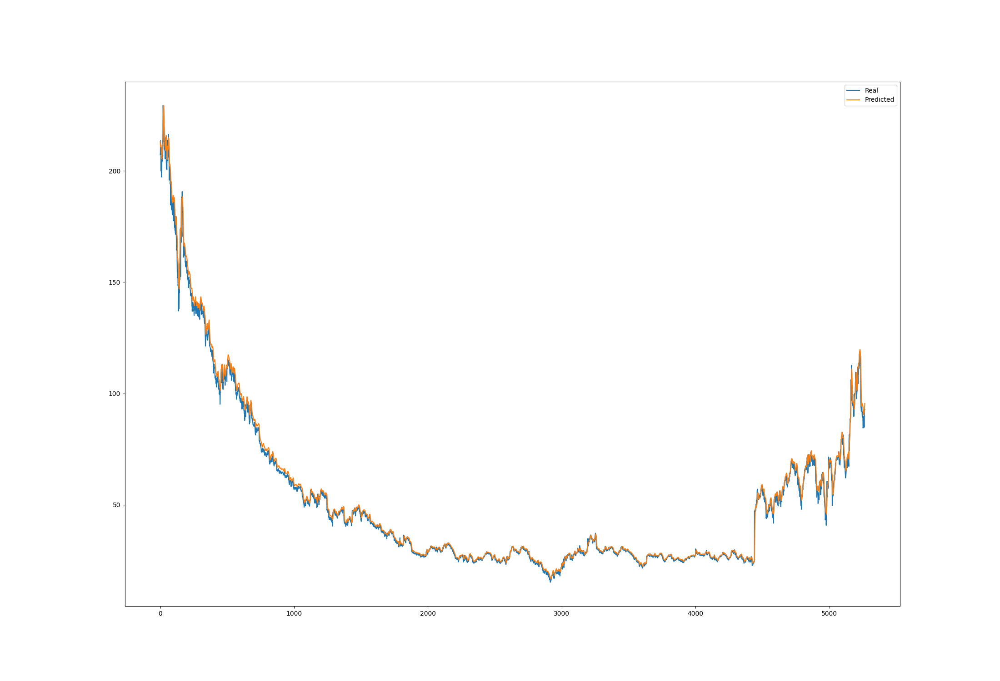
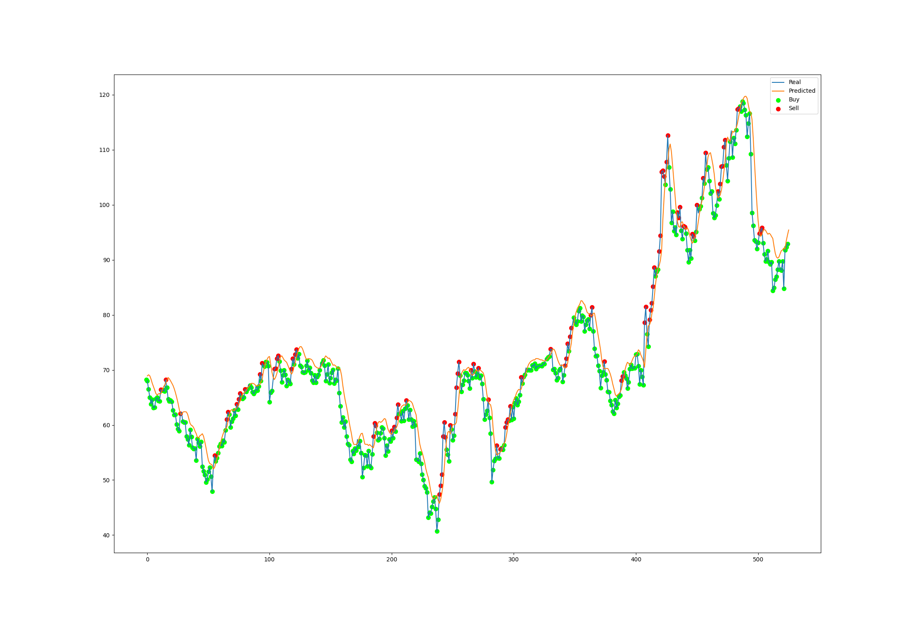

# Predicting the stock market

## An attempt to use RNN (Recurrent Neural Networks) to predict market opening values.

Used the idea of Long Short Term Memory (LSTM) to implement a RNN network. 
RNN performs the same function for every input of data while the output of the current input depends on the prior computation. For each output produced, it is copied and sent back into the network as an input for the next iteration, therefore considering both the current input and the past computation to make a decision.

## Advantages of RNNs
- RNN can model sequence of data so that each sample can be assumed to be dependent on previous ones
- RNN are even used with convolutional layers to extend the effective pixel neighbourhood

## Disadvantages of RNNs
- Gradient vanishing and exploding problems
- Training an RNN is a very difficult task
- It cannot process very long sequences if using tanh or relu as an activation function

## Vanishing Gradient Problem
The further you go through the network, the lower your gradient is (the gradients of our loss function will approach zero) and the harder it is to train the weights (RNN uses backpropogation to train weights), therefore having a domino effect on all further weights throughout the network.

## Using LSTM as our RNN
LSTM are a modified version of RNN. The usage of an LSTM over RNN can resolve the vanishing gradient problem. LSTM contain an input, forget, and output gate.

## Input Gate
This gate determines which values from the input should be used to modify the memory. A Sigmoid function decides which values to let through by values of 0 (omit) and 1 (keep) and a tanh function is used to give weightage to the values which are passed deciding their level of importance ranging from -1 to 1.

## Forget Gate
This gate determines what details to be discarded from the block using a sigmoid function. It looks at the previous state and the content input and outputs a number between 0 (omit) and 1 (keep) for each number in the cell state.

## Output Gate
The input and the memory of the block is used to decide the output. A sigmoid function decides which values to let through using 0 (omit) and 1 (keep). A tanh function provides weightage to the values which are passed deciding their level of importance ranging from -1 to 1 and multiplied with the output of Sigmoid.

 

# My Model
The model is a recurrent neural network with two input layers: LSTM input layer and technical indicators (dense) input layer. These inputs are then pooled together and put through a sigmoid activation. The model uses an adam optimizer with a learning rate of 0.0005 and a MSE loss function.

## LSTM Input Layer
For the LSTM input layer, a dropout with a frequency rate of 0.2 is used at each step during training to help prevent overfitting.

## Technical Indicator (Dense) Layer
For the technical indicator layer, the inputs undergo a ReLU activation function. They then undergo a dropout with a frequency rate of 0.2 at each step during training to help prevent overfitting.

 

## Model Diagram

 

## Model Accuracy

 

# Results (MSFT Daily)
Over a span of 500 days, using MSFT daily opening values to train our model and predict MSFT opening day values. We were able to achieve a 6X return on investments using a naive trading algorithm.

 

